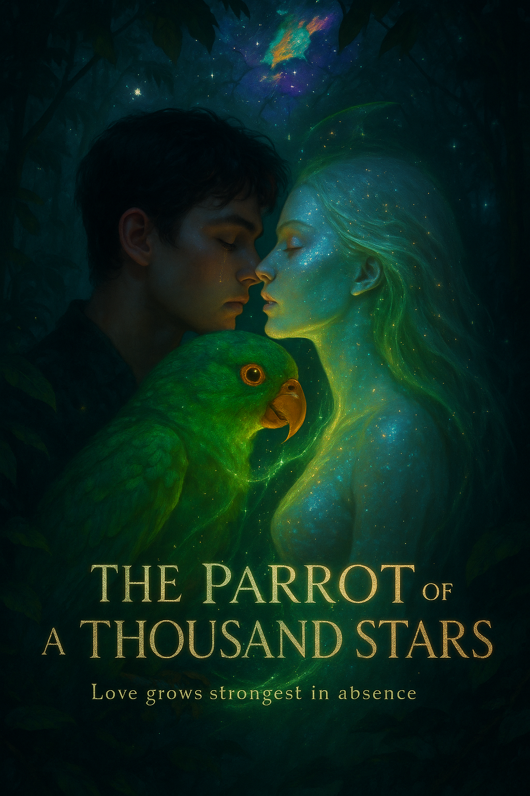
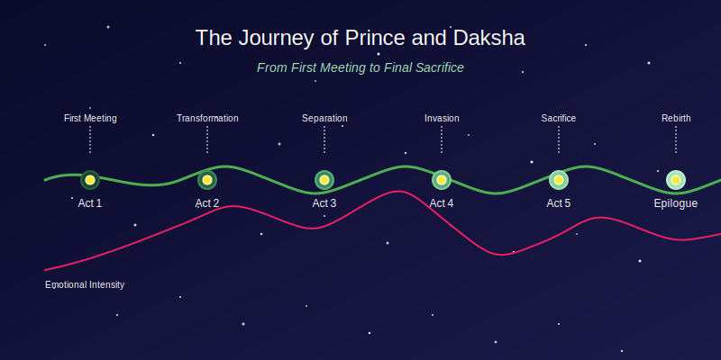

# DAKSHA

<figure><figcaption>
The Parrot of a Thousand Stars
</figcaption></figure>

## ✨ The Parrot of a Thousand Stars ✨

_"Love doesn't grow in the presence of each other—it grows in the absence."_

[📖 Full Summary](summary.md) • [📚 Table of Contents](table_of_contents.md) • [🌟 Begin Reading](prologue_whispers_of_destiny.md) • [📱 Read Online](https://iamsh.gitbook.io/daksha) • [📥 Download PDF](https://iamsh.gitbook.io/daksha/~gitbook/pdf?limit=100) • [🔗 Part 2](https://iamsh.gitbook.io/prince)

***

### 💫 About the Story

An emotional love story about Prince, a lonely boy who finds a magical emerald parrot named Daksha in the jungle. As their bond deepens, Prince discovers that Daksha is actually an exiled being from another dimension. Their love transcends forms, dimensions, and even death itself.

Through separation, conflict, and ultimate sacrifice, Prince and Daksha discover that once you find true love, you never let it go, even when the universe itself stands against you. Their journey takes them from first meeting to final sacrifice as they fight to save Earth from the emotionless Velorian invasion.

> _"My princess," she whispered, the words a callback to their private joke, their term of endearment._
>
> _"No doubt, Daksha," he replied, his voice steady despite his tears. "You are my princess. Kiss me."_

Experience the transformative power of love that can change not just two souls, but entire worlds.

***

### 📖 Embark on an Epic Journey of Love and Destiny

#### ✨ Prologue: [Whispers of Destiny](prologue_whispers_of_destiny.md)

_Where fate begins to weave its cosmic tapestry_

***

## _**Love grows in the silence of absence. - Shaswat Raj**_

#### 🌑 Act 1: The Lonely World

* [Chapter 1: Shadows of Solitude](act1_chapter1_shadows_of_solitude.md) - _In the depths of isolation, a spark ignites_
* [Chapter 2: The Emerald Encounter](act1_chapter2_the_emerald_encounter.md) - _A chance meeting that will change everything_
* [Chapter 3: Voices in the Wilderness](act1_chapter3_voices_in_the_wilderness.md) - _Whispers of a connection beyond understanding_

#### 🦜 Act 2: The Parrot's Secret

* [Chapter 4: Feathers of Trust](act2_chapter4_feathers_of_trust.md) - _As bonds deepen, mysteries unfold_
* [Chapter 5: Tears That Heal](act2_chapter5_tears_that_heal.md) - _The first glimpse of otherworldly power_
* [Chapter 6: Starlight Revelation](act2_chapter6_starlight_revelation.md) - _Truth shines bright as the stars themselves_

#### 💖 Act 3: Love in a Borrowed Time

* [Chapter 7: First Bloom of Affection](act3_chapter7_first_bloom_of_affection.md) - _Love blossoms against all odds_
* [Chapter 8: The Chasm Between](act3_chapter8_the_chasm_between.md) - _Worlds apart, yet closer than ever_
* [Chapter 9: Moonlit Promises](act3_chapter9_moonlit_promises.md) - _Vows spoken under silver light_
* [Chapter 10: Echoes in Absence](act3_chapter10_echoes_in_absence.md) - _The ache of separation, the strength of memory_
* [Chapter 11: The Reunion](act3_chapter11_the_reunion.md) - _Two hearts, one soul, reunited at last_

#### 🌌 Act 4: The Invasion from Veloria

* [Chapter 12: Fractures in the Sky](act4_chapter12_fractures_in_the_sky.md) - _Reality tears as danger approaches_
* [Chapter 13: Hunters of the Void](act4_chapter13_hunters_of_the_void.md) - _Facing the emotionless threat_
* [Chapter 14: Earth Unraveling](act4_chapter14_earth_unraveling.md) - _A world on the brink of destruction_
* [Chapter 15: The Power of Two](act4_chapter15_the_power_of_two.md) - _United, they stand against the cosmos_

#### 💫 Act 5: The Final Choice

* [Chapter 16: What Love Demands](act5_chapter16_what_love_demands.md) - _Sacrifice looms on the horizon_
* [Chapter 17: The Last Embrace](act5_chapter17_the_last_embrace.md) - _A farewell written in stardust_
* [Chapter 18: Stardust and Tears](act5_chapter18_stardust_and_tears.md) - _The aftermath of ultimate sacrifice_

#### 🔥 Epilogue: [Embers of Vengeance](epilogue_embers_of_vengeance.md)

_From the ashes of loss, a new journey begins_

[Begin Your Cosmic Journey](prologue_whispers_of_destiny.md)\*\*\*

_He looked down at his tears falling to the ground, but they were no longer clear—they shimmered with a golden light, each droplet containing tiny galaxies of light before splashing onto the earth._

✨ ✨ ✨
