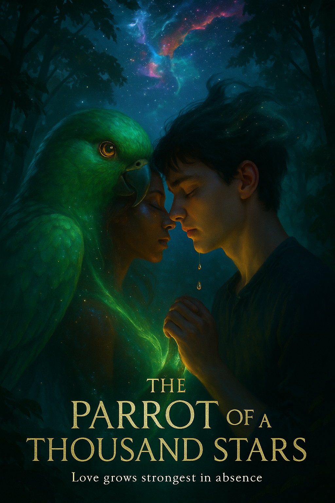

  
  <h1>✨ The Parrot of a Thousand Stars ✨</h1>
  
<em>"Love doesn't grow in the presence of each other—it grows in the absence."</em>

  <a href="summary.md">📖 Full Summary</a> •
  <a href="table_of_contents.md">📚 Table of Contents</a> •
  <a href="prologue_whispers_of_destiny.md">🌟 Begin Reading</a>

---

## 💫 About the Story

An emotional love story about Prince, a lonely boy who finds a magical emerald parrot named Daksha in the jungle. As their bond deepens, Prince discovers that Daksha is actually an exiled being from another dimension. Their love transcends forms, dimensions, and even death itself.

Through separation, conflict, and ultimate sacrifice, Prince and Daksha discover that once you find true love, you never let it go, even when the universe itself stands against you. Their journey takes them from first meeting to final sacrifice as they fight to save Earth from the emotionless Velorian invasion.

> *"My princess," she whispered, the words a callback to their private joke, their term of endearment.*
>
> *"No doubt, Daksha," he replied, his voice steady despite his tears. "You are my princess. Kiss me."*

Experience the transformative power of love that can change not just two souls, but entire worlds.

---

## 📖 Journey Through the Story

### ✨ Prologue
- [Whispers of Destiny](prologue_whispers_of_destiny.md)

### 🌑 Act 1: The Lonely World
- [Chapter 1: Shadows of Solitude](act1_chapter1_shadows_of_solitude.md)
- [Chapter 2: The Emerald Encounter](act1_chapter2_the_emerald_encounter.md)
- [Chapter 3: Voices in the Wilderness](act1_chapter3_voices_in_the_wilderness.md)

### 🦜 Act 2: The Parrot's Secret
- [Chapter 4: Feathers of Trust](act2_chapter4_feathers_of_trust.md)
- [Chapter 5: Tears That Heal](act2_chapter5_tears_that_heal.md)
- [Chapter 6: Starlight Revelation](act2_chapter6_starlight_revelation.md)

### 💖 Act 3: Love in a Borrowed Time
- [Chapter 7: First Bloom of Affection](act3_chapter7_first_bloom_of_affection.md)
- [Chapter 8: The Chasm Between](act3_chapter8_the_chasm_between.md)
- [Chapter 9: Moonlit Promises](act3_chapter9_moonlit_promises.md)
- [Chapter 10: Echoes in Absence](act3_chapter10_echoes_in_absence.md)
- [Chapter 11: The Reunion](act3_chapter11_the_reunion.md)

### 🌌 Act 4: The Invasion from Veloria
- [Chapter 12: Fractures in the Sky](act4_chapter12_fractures_in_the_sky.md)
- [Chapter 13: Hunters of the Void](act4_chapter13_hunters_of_the_void.md)
- [Chapter 14: Earth Unraveling](act4_chapter14_earth_unraveling.md)
- [Chapter 15: The Power of Two](act4_chapter15_the_power_of_two.md)

### 💫 Act 5: The Final Choice
- [Chapter 16: What Love Demands](act5_chapter16_what_love_demands.md)
- [Chapter 17: The Last Embrace](act5_chapter17_the_last_embrace.md)
- [Chapter 18: Stardust and Tears](act5_chapter18_stardust_and_tears.md)

### 🔥 Epilogue
- [Embers of Vengeance](epilogue_embers_of_vengeance.md)

---

  
<em>He looked down at his tears falling to the ground, but they were no longer clear—they shimmered with a golden light, each droplet containing tiny galaxies of light before splashing onto the earth.</em>

  
✨ ✨ ✨

