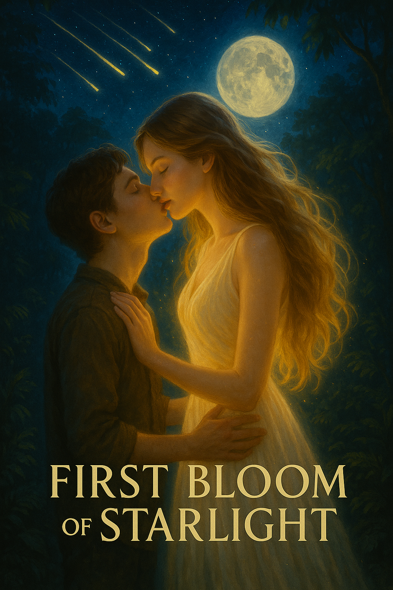

# Chapter 6: Starlight Revelation

---

The night of the meteor shower changed everything.

Prince had been excited about it for weeks, marking the date on his calendar, reading everything he could find about the Perseids in the small town library. Daksha had listened to his enthusiastic explanations with what seemed like polite interest, but as the date approached, Prince noticed a change in her behavior.

She grew quieter, more distracted. Sometimes he would catch her staring at the sky with an intensity that seemed almost fearful. When he asked what was wrong, she would simply say, "Nothing," and change the subject.

The evening of the shower, Prince packed a small bag with snacks, a blanket, and his journal. They had a special spot in the jungle—a small clearing on a hill that offered a perfect view of the night sky, away from the town's lights.

"Are you sure you want to go?" Daksha asked as they prepared to leave. She was perched on his shoulder, her emerald feathers dimmer than usual.

"Of course! I've been waiting for this all month," Prince replied, confused by her reluctance. "Don't you want to see it?"

"It's not that," Daksha said, her voice uncharacteristically hesitant. "It's just... meteor showers can have... effects."

"Effects? Like what?"

"On dimensional barriers," she said after a pause. "They create... ripples."

Prince frowned, pausing in the middle of packing his bag. "Is that dangerous? For you, I mean?"

"Not dangerous, exactly," Daksha said. "Just... unpredictable."

Despite her warnings, they went. Prince couldn't bear to miss the shower, and Daksha seemed unwilling to let him go alone. As they made their way through the jungle in the fading light, Prince tried to keep the conversation light, pointing out interesting plants and animals, but Daksha remained unusually quiet.

They reached their spot just as darkness fell. Prince spread the blanket on the ground and lay back, looking up at the emerging stars. Daksha perched on a nearby branch, her amber eyes fixed on the sky.

"The first meteors should start soon," Prince said, trying to recapture his earlier excitement. "The book said there could be up to a hundred per hour at the peak."

Daksha made a small sound that might have been acknowledgment, but her attention remained on the sky. Prince followed her gaze but saw nothing unusual—just the familiar constellations he had learned to identify over the years.

"Daksha," he said after a while, "what's really bothering you? You've been acting strange all day."

She turned to look at him then, and even in the dim light, he could see the conflict in her eyes. "I'm afraid," she admitted, her voice barely audible.

"Of what?"

"Of what might happen tonight. Of... change."

Before Prince could ask more questions, the first meteor streaked across the sky—a brilliant flash of light that left a glowing trail in its wake. He gasped in delight, momentarily distracted from his concern.

More meteors followed, first one at a time, then in pairs, then in clusters that made it impossible to track them all. The sky seemed alive with movement, with light, with a kind of cosmic dance that took Prince's breath away.

But when he looked over at Daksha, his wonder turned to alarm. She was trembling on her branch, her feathers glowing with an intensity he had never seen before. The light pulsed in rhythm with the meteors' appearance, growing brighter with each new streak across the sky.

"Daksha?" he called, sitting up. "What's happening?"

"I can't... control it," she gasped, her voice strained. "The meteors... they're weakening the constraints."

"Constraints? What constraints?" Prince stood, moving toward her with growing concern.

"The ones that bind me to this form," Daksha said, her voice taking on that resonant quality he had heard only once before, when she had healed him with her tears. "The ones that were placed on me during my exile."

As the meteor shower intensified, Daksha's glow grew stronger, until she was shining as brightly as the shooting stars themselves. Prince had to shield his eyes, squinting to see her through the radiance.

"Daksha!" he called, suddenly afraid. "What's happening to you?"

"Stand back," she warned, her voice no longer sounding like a parrot's at all. "I can't... hold it..."

There was a flash of light so intense it left Prince momentarily blind. He felt a rush of wind, a surge of energy that made the hair on his arms stand on end. And then... silence.

As his vision cleared, Prince looked around frantically for Daksha. The parrot was gone. In her place, standing on the blanket before him, was a young woman.

She was tall and slender, with skin that seemed to shimmer with an inner light, like moonlight on water. Her hair was long and dark, flowing around her like liquid shadow. And her eyes—they were the same amber as Daksha's, with the same ancient wisdom, the same kindness.

But it was her dress that confirmed her identity beyond any doubt—a flowing gown of the exact emerald green that Daksha's feathers had been, shimmering with the same inner light.

"Daksha?" Prince whispered, his voice barely audible even to himself.

The woman smiled, and it was like watching the sun rise. "Hello, Prince," she said, and though the voice was richer, fuller than the parrot's had been, it was unmistakably Daksha's.

Prince stared, unable to form words. This was the woman from his fever dream—the figure in the mist who had told him to find her when the stars aligned.

"How...?" he finally managed.

Daksha looked down at her hands, turning them over as if seeing them for the first time. "The meteor shower," she explained. "It created a harmonic resonance that temporarily neutralized the constraints of my exile. I don't know how long it will last, but... for now, I am as I was before."

Prince took a step toward her, then stopped, suddenly unsure. This beautiful, otherworldly woman was his friend, the parrot who had shared his room, his thoughts, his life for months now. But she was also a stranger—a being from another dimension whose true nature he was only beginning to glimpse.

"Are you... are you still you?" he asked, the question sounding childish even to his own ears.

Daksha's smile softened. "I am still me," she assured him. "Just... more of me than you've been able to see until now."

She took a step toward him, closing the distance between them. She was taller than him in this form—he had to look up to meet her eyes. Up close, he could see that her skin wasn't just shimmering; it was subtly translucent, as if light passed through her rather than reflecting off her.

"May I?" she asked, raising her hand toward his face.

Prince nodded, not trusting himself to speak. Daksha's fingers—long, elegant, and cool to the touch—brushed his cheek with infinite gentleness. The contact sent a shiver through him, not of cold but of recognition. This was Daksha—his Daksha—in a form he had never seen but somehow always known.

"I've wanted to do that for so long," she said softly. "To touch you properly. To see you through these eyes."

"Why didn't you tell me?" Prince asked, finding his voice at last. "That you could... that you were..."

"Human?" Daksha supplied with a small smile. "I'm not, not really. This form is closer to my true self than the parrot, but it's still a compromise—solid enough to interact with your world, but still connected to my essence."

"Then what are you, really?" Prince asked, the question he had been afraid to ask for so long finally finding voice.

Daksha took a deep breath, as if steeling herself. "I am a Velorian," she said. "A being from a civilization that exists in a dimension parallel to yours. We evolved beyond physical limitations millennia ago. We can manipulate the very fabric of reality, fold space, even alter time."

"Like... gods?" Prince asked, trying to comprehend.

"No," Daksha said firmly. "Not gods. Just a different kind of being, with different abilities. And different flaws."

She turned away from him, looking up at the meteor shower that continued overhead. "My people achieved what they considered perfection," she continued. "Perfect order. Perfect logic. Perfect control over their environment and themselves. But the cost..."

"The emotions," Prince said, remembering their earlier conversations. "They purged them."

"Yes," Daksha confirmed, turning back to him. "They decided that emotions were inefficient, dangerous. That they led to conflict, to irrationality, to chaos. So they systematically eliminated them from their society—first through behavioral conditioning, then through neural modification, and finally through genetic engineering."

"But not you," Prince said. "You found emotions again. Through that book of poetry."

Daksha's eyes widened slightly. "You remember," she said, sounding pleased. "Yes. I was a Keeper of Records—responsible for maintaining the historical archives, including the sealed vaults that contained artifacts from before the Great Purge. I found a book of poetry, and it... awakened something in me. Something that had been dormant, suppressed, but never fully eliminated from our genetic memory."

"And they exiled you for that?" Prince asked, indignation rising in him. "For feeling?"

"They considered me contaminated," Daksha explained. "A threat to their perfect order. They stripped me of most of my abilities, transformed me into what they considered a lesser form—the parrot—and cast me into this dimension."

"But why a parrot?" Prince asked, genuinely curious. "Why not... I don't know, a rock or something?"

Daksha laughed—a sound so beautiful, so musical, that Prince felt his heart skip a beat. "The punishment was meant to be ironic," she explained. "I had discovered the power of words, of poetry. So they gave me a form that could speak but would never be taken seriously—a mimic, a pet, a curiosity at best."

"That's cruel," Prince said, anger flaring on her behalf.

"It was meant to be," Daksha agreed. "But they underestimated both me and this world. They didn't account for the possibility that I might find someone like you—someone who would listen, who would care, who would see beyond the form to the being inside."

She reached out and took his hand, her touch sending that same shiver of recognition through him. "They didn't account for friendship," she said softly. "For connection. For love."

The word hung in the air between them, charged with meaning. Prince felt his heart racing, his palms suddenly sweaty. Love. Was that what this was—this feeling that had been growing in him for months, this connection that defied explanation?

"I don't understand something," he said, changing the subject before his emotions overwhelmed him. "If you were exiled, if they took away your powers, how were you able to heal me when I was sick? How can you change forms now?"

Daksha's expression grew more serious. "The constraints they placed on me were meant to be permanent," she explained. "But they're weakening. Every time I use what remains of my abilities—like when I healed you with my tears—the constraints fracture a little more. And tonight, with the meteor shower creating a dimensional resonance..."

"They broke completely?" Prince guessed.

"Temporarily," Daksha corrected. "When the shower ends, when the resonance fades, I'll likely return to the parrot form. But each time the constraints weaken, it becomes easier to break them again."

Prince tried to process everything she was telling him. Daksha was an exiled being from another dimension, a civilization so advanced they could manipulate reality itself, but so cold they had purged all emotion. She had been punished for the crime of feeling, transformed and cast out. And now, standing before him in this beautiful, almost-human form, she was telling him that the barriers of her exile were weakening.

"What does that mean?" he asked. "For you? For... us?"

Daksha's amber eyes studied him with an intensity that made his breath catch. "It means change," she said simply. "It means possibilities I didn't dare hope for when I first found myself in this world. It means..."

She trailed off, looking up at the meteor shower again. "It means danger too," she admitted. "The weakening constraints don't just allow me more freedom; they also make me more... detectable."

"Detectable?" Prince repeated, a chill running through him. "By whom?"

"By my people," Daksha said, her voice dropping. "By Veloria. If they notice the dimensional disturbances, if they trace them back to me..."

She didn't finish the sentence, but she didn't need to. Prince could see the fear in her eyes, could feel it in the slight trembling of her hand still holding his.

"They would try to take you back?" he asked, though he suspected the answer was worse than that.

"They would try to eliminate me," Daksha corrected. "And anything—anyone—contaminated by my presence."

The implications hit Prince like a physical blow. "Me," he said. "They would come after me too."

"Yes," Daksha confirmed, her grip on his hand tightening. "Which is why I've been so careful, why I've tried to limit my use of abilities, why I've maintained the parrot form even when it became possible to shift briefly. To protect you."

Prince felt a surge of emotions—fear, yes, but also a fierce protectiveness, a determination that surprised him with its intensity. "I'm not afraid," he said, and was startled to realize it was true. "Whatever comes, we'll face it together."

Daksha's eyes widened, then softened with an emotion that made his heart race. "Together," she repeated, the word sounding like a promise, like a vow.

They stood in silence for a moment, hand in hand under the meteor-streaked sky. Prince was acutely aware of Daksha's presence—of her height, her otherworldly beauty, the subtle glow that emanated from her skin. Of the fact that this was Daksha—his friend, his confidante, the being who had seen him when no one else did—in a form that made his pulse quicken and his thoughts scatter.

"What happens now?" he asked, his voice sounding strange to his own ears.

Daksha looked down at their joined hands, then back up at him. "Now," she said softly, "we have a choice. I can try to maintain the constraints, to stay hidden, to continue as we have been. Or..."

"Or?" Prince prompted when she didn't continue.

"Or we can see where this leads," Daksha said, gesturing between them with her free hand. "This connection between us. But Prince, you must understand—it's uncharted territory. My people never allowed themselves to form emotional bonds like this. I don't know what will happen."

Prince thought about what she was saying—about constraints and connections, about danger and possibility. About the look in her eyes that made his heart feel too big for his chest.

"I know what happens if we try to stay the same," he said quietly. "And I don't want that. I want... more. With you."

The words hung in the air between them, bold and terrifying in their honesty. For a moment, Prince thought he had gone too far, said too much. Then Daksha smiled—a smile so radiant it rivaled the meteors still streaking overhead.

"I want that too," she admitted, her voice barely above a whisper. "More than I've ever wanted anything."

She took a step closer, eliminating the last of the distance between them. Prince had to tilt his head back to maintain eye contact, acutely aware of her height, of the otherworldly grace that surrounded her like an aura.

"May I?" she asked again, but this time her gaze dropped to his lips, making her meaning unmistakable.

Prince nodded, his heart hammering so hard he was sure she could hear it. Daksha leaned down, her movements slow and deliberate, giving him time to pull away if he wanted to. But pulling away was the last thing on Prince's mind.

When their lips met, time seemed to stand still. The gentle night breeze carried the sweet scent of jasmine, and the meteors painted the sky with streaks of silver light, creating a magical ambiance around them. Prince's heart thundered in his chest as he experienced his first kiss—a moment both tender and electric. Daksha's lips were impossibly soft, cool like starlight yet warming his entire being from within.

The world around them faded into a kaleidoscope of sensations: the subtle glow emanating from Daksha's skin illuminated their intimate moment, while the distant chorus of jungle creatures provided a gentle symphony. Each point of contact between them sparked with energy—her hands on his shoulders, his fingers gently cupping her face. The kiss deepened naturally, like two stars drawn together by gravity, and Prince felt as if he was touching pure magic.

The universe exploded into a supernova of sensation. Time ceased to exist, reality melted away, and all that remained was this singular, earth-shattering moment. The night air crackled with electricity, each meteor streak igniting the sky like fireworks celebrating their union. Prince's heart no longer merely thundered—it threatened to burst from his chest, overwhelmed by the tidal wave of emotion crashing through him.

Daksha's lips were a revelation—impossibly soft yet burning with an otherworldly heat that seared his very soul. Her taste was intoxicating, a mixture of stardust and wild honey that left him dizzy and desperate for more. Every nerve in his body came alive, hypersensitive to her touch—her hands on his shoulders sent shockwaves through him, while his fingers, trembling as they cupped her face, felt like they were touching pure, unfiltered magic.

The world around them didn't just fade—it ceased to exist entirely. There was only Daksha, only this kiss, only this all-consuming, reality-altering connection between them. As the kiss deepened, Prince felt as if he was being unmade and remade, molecule by molecule, into something new, something more. It was terrifying and exhilarating, like free-falling through space and knowing you'll never hit the ground.

Through their joined lips, Prince could feel every emotion Daksha had ever experienced flooding into him—her joy, her wonder, her longing, her love. But more than that, he could feel the very essence of her being merging with his own. It was a fusion of souls so profound, so earth-shatteringly intense, that he knew he would never be the same again. This wasn't just a kiss—it was a rebirth, a revelation, a rewriting of the very fabric of his existence.

As they clung to each other under the meteor-streaked sky, Prince knew with absolute certainty that he would spend the rest of his life chasing this feeling, this connection, this love. Nothing else would ever compare. Nothing else would ever be enough.

It was unlike anything he could have imagined—not just a meeting of lips, but a fusion of souls. Like being filled with liquid starlight, with warmth, with a connection so profound it transcended the physical realm. Through their touch, he could feel every emotion Daksha had discovered in her exile: joy, wonder, longing, and most powerfully, love.

He felt that now-familiar rush of shared emotions—joy, wonder, desire, love—flowing between them like a current. But stronger than ever before, more focused, more intense. It was overwhelming in the best possible way, like drowning in starlight.

When they finally broke apart, both breathless, Prince noticed that Daksha was crying—silent tears that glowed like liquid starlight as they traced paths down her cheeks.

"What's wrong?" he asked, concerned.

"Nothing," she assured him, smiling through her tears. "Nothing at all. It's just... I never imagined I could feel this much. That any being could contain such emotion without breaking apart."

Prince reached up to gently wipe away her tears, marveling at how they seemed to glow even on his fingertips. "Maybe that's why your people feared emotions," he suggested. "Because they're powerful. Transformative."

"Yes," Daksha agreed. "They change you. Forever." She looked up at the meteor-streaked sky, then back at Prince. "And I would not change this—change us—for all the perfect order of Veloria."

They kissed again, lost in each other, in the miracle of their impossible connection. Neither noticed that the meteor shower was beginning to wane, that the dimensional resonance was fading, until Daksha suddenly pulled back with a gasp of pain.

"What is it?" Prince asked, alarmed.

"The constraints," she said, her voice strained. "They're reasserting themselves. I can feel them... pulling me back."

Even as she spoke, her form began to shimmer, to lose its solidity. The emerald gown seemed to melt into her skin, which was glowing brighter by the second.

"No," Prince protested, reaching for her. "Not yet. We just found each other, like this."

Daksha took his hands, her touch already less substantial. "We were always found, Prince," she said, her voice taking on that resonant quality again. "From the moment you picked me up in the jungle. This form is just... a shell. What matters is the connection between us. And that remains, no matter what shape I wear."

Prince knew she was right, but still felt a sense of loss as her human form continued to dissolve, becoming that familiar orb of emerald energy. "Will it happen again?" he asked. "Will you be able to transform again?"

"I believe so," the orb replied, Daksha's voice now coming from everywhere and nowhere. "The constraints are weakening permanently, not just temporarily. It may take time, but... I think this is a beginning, not an end."

The orb pulsed once, twice, then began to contract, to take on the familiar shape of the emerald parrot. Within moments, Daksha was perched on Prince's shoulder, her feathers glowing with that familiar, comforting light.

"Well," she said, her voice back to the one Prince was accustomed to, "that was... enlightening."

Prince laughed, the sound slightly choked with emotion. "That's one way to put it."

They made their way back through the jungle, the meteor shower now reduced to occasional streaks across the sky. Prince was acutely aware of Daksha's weight on his shoulder, of the brush of her feathers against his cheek. It was familiar, comforting—but now charged with new meaning, new possibilities.

"Do you regret it?" he asked after a while. "Going back to this form?"

"No," Daksha replied without hesitation. "Each form has its purpose, its time. And as I said, what matters is not the shell but what's inside it." She nuzzled closer to him. "Besides, I rather like being able to sit on your shoulder. There are advantages to being small."

Prince smiled, reaching up to gently stroke her feathers. "I love you," he said, testing the words in this new context, with Daksha back in her parrot form. "No matter what shape you're in."

"And I love you," Daksha replied, her feathers brightening with emotion. "Across dimensions, across forms, across time itself."

As they walked home under the fading meteor shower, the full moon bathing them in silver light, Prince felt a sense of peace, of rightness, that he had never known before. Whatever challenges lay ahead—and he knew there would be many—they would face them together.

Because some connections transcend physical form. Some loves defy the constraints of different worlds, different realities.

Some revelations, once experienced under a meteor-streaked sky, can never be forgotten.
